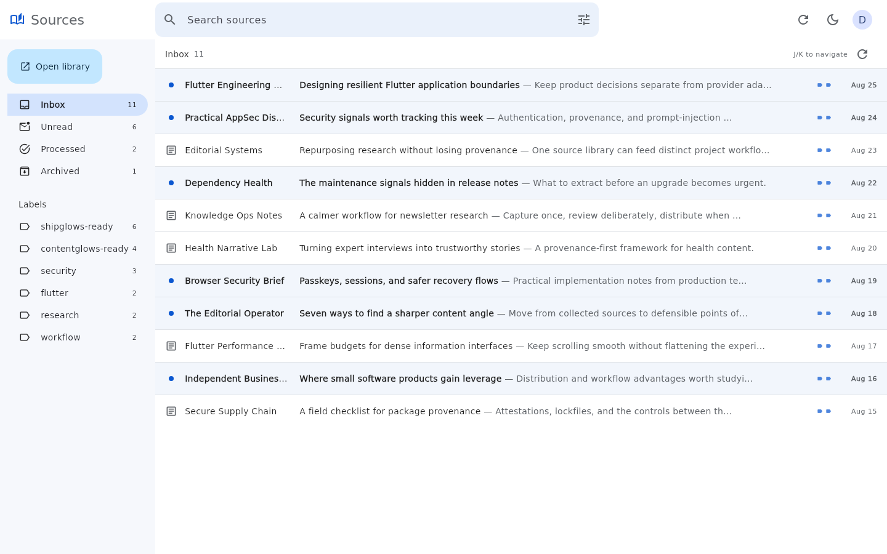
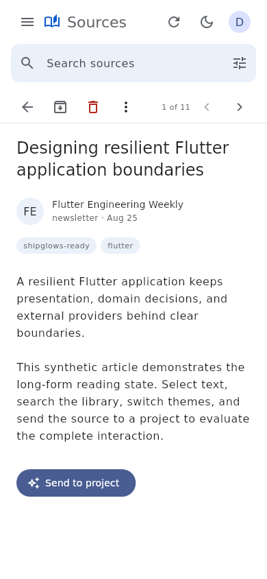

# Sources and Newsletter Studio for Flutter

This public repository owns two native, provider-neutral Flutter presentation
packages consumed by CommandGlows applications: `source_sidebar_flutter` for
collecting and reading sources, and `newsletter_studio_flutter` for turning
selected sources into a reviewable newsletter draft. Neither package is a
WebView wrapper.

The Flutter Web demo consumes both real packages with synthetic data and typed
simulated hooks. It contains no Readwise or delivery-provider token, performs
no network mutation, and cannot alter a real library or send an email.

The original v0/React prototype remains available in Git history as the initial
interaction reference; it is no longer an active application or deployment.

The shared visual grammar uses a 64 px global header, Gmail-like navigation,
dense desktop information layouts, compact mobile navigation, visible keyboard
focus, semantic categories, and restrained blue focus and selection states.

## Visual proof

The source proof images below were generated from the real Flutter preview with
only synthetic sources. Newsletter Studio visual proof still requires an
authorized hosted preview after CI; the implementation must not be represented
as inbox-rendering or deliverability proof.





## Repository layout

- `packages/source_sidebar_flutter`: reusable Flutter presentation package.
- `packages/newsletter_studio_flutter`: reusable newsletter composition and
  review package with provider-neutral host hooks.
- `demo`: unified Flutter Web preview consuming both packages by local path.
- `scripts/vercel-build.sh`: reproducible Vercel build with Flutter 3.41.7.
- `shipglows_data/visual-proof`: inspected desktop and mobile reference
  captures for the current Flutter implementation.

## Run the preview locally

```bash
cd demo
flutter pub get
flutter run -d chrome
```

## Validate

```bash
cd packages/source_sidebar_flutter
flutter analyze
flutter test

cd ../newsletter_studio_flutter
flutter analyze
flutter test

cd ../../demo
flutter analyze
flutter test
flutter build web --release
```

Licensed under the MIT License.
